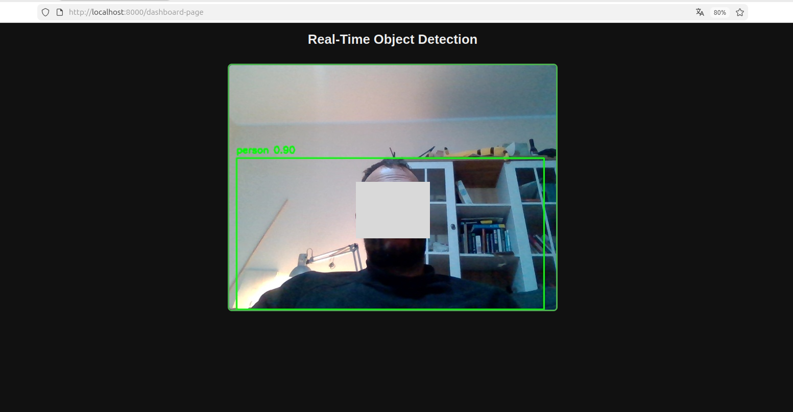
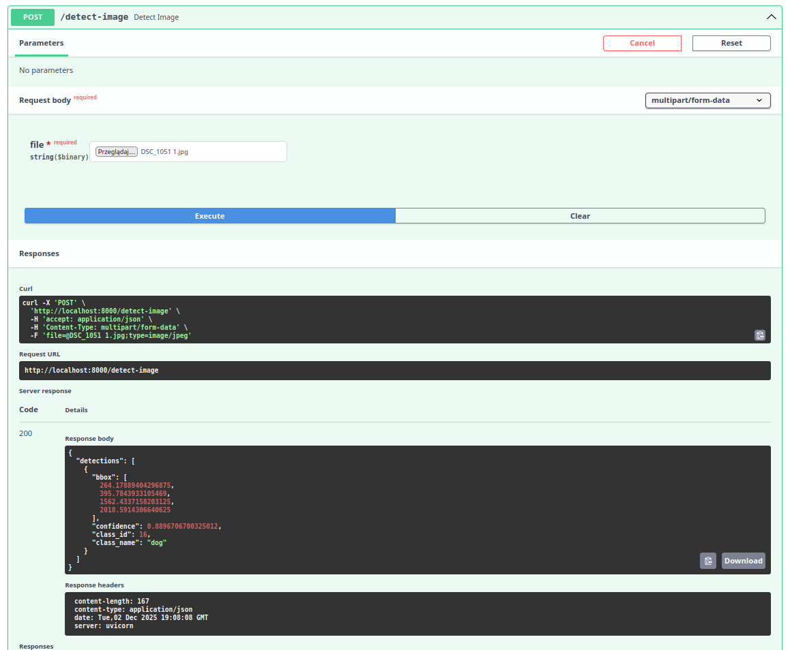

# Real-Time Object Detection — FastAPI + YOLO

A real-time computer vision inference system built with **FastAPI**, **YOLOv8**, and **OpenCV**.  
The application performs live object detection from a video stream and exposes results via a web dashboard.

This project demonstrates **end-to-end ML Engineering skills**:
model loading, inference loop, real-time streaming, backend API, frontend dashboard, and Dockerization.

---

## 🚀 Features

- Real-time object detection using YOLOv8
- Live video stream with bounding boxes and class labels
- FastAPI backend with streaming endpoint
- MJPEG-based video streaming
- Simple web dashboard (HTML + CSS)
- Dockerized application (CPU-friendly)
- Clean, production-style project structure
- Designed for further extension (e.g. WebSockets)

---

## 🧠 Architecture

```mermaid
flowchart TD
    A[Camera / Video Source] --> B[OpenCV]
    B --> C[YOLOv8 Inference]
    C --> D[FastAPI Streaming Endpoint]
    D --> E[Web Dashboard (MJPEG)]
```

---

## ⚙️ How it works

1. Video frames are captured using OpenCV.
2. Each frame is passed through a YOLOv8 object detection model.
3. Detected bounding boxes and class labels are drawn on the frame.
4. Processed frames are streamed to the client using an MJPEG stream.
5. A web dashboard displays the live detection results in real time.

---

## 📂 Project Structure

```
.
├── app/
│   ├── main.py           # FastAPI application
│   ├── detector.py       # YOLO model loading and inference
│   └── video_stream.py   # MJPEG streaming logic
├── dashboard/
│   ├── index.html        # Web dashboard
│   ├── style.css
│   └── script.js
├── models/
│   └── yolov8n.pt
├── assets/
│   ├── dashboard-demo.png
│   └── screenshot-docs.png
├── tests/
├── Dockerfile
├── requirements.txt
└── README.md
```

---

## ▶️ Run locally

Install dependencies:

```bash
pip install -r requirements.txt
```

Start the server:

```bash
uvicorn app.main:app --reload
```

Open in browser:

* API docs: [http://localhost:8000/docs](http://localhost:8000/docs)
* Live stream: [http://localhost:8000/video-stream](http://localhost:8000/video-stream)
* Dashboard: [http://localhost:8000/dashboard-page](http://localhost:8000/dashboard-page)

---

## 🐳 Run with Docker

Build the Docker image:

```bash
docker build -t cv-stream .
```

Run the container:

```bash
docker run -p 8000:8000 cv-stream
```

Access the application:

* API docs: [http://localhost:8000/docs](http://localhost:8000/docs)
* Live stream: [http://localhost:8000/video-stream](http://localhost:8000/video-stream)
* Dashboard: [http://localhost:8000/dashboard-page](http://localhost:8000/dashboard-page)

> Note: The Docker image is CPU-only.
> Camera access from inside Docker may depend on the host OS and configuration.
> The YOLOv8 model weights are downloaded automatically at runtime and are not stored in the repository.


---

## 📸 Demo

### Live Dashboard



### API Documentation



---

## 🧰 Tech Stack

* Python
* FastAPI
* YOLOv8 (Ultralytics)
* OpenCV
* MJPEG Streaming
* Docker
* HTML / CSS

---

## 🛣️ Roadmap

* [x] Real-time MJPEG streaming
* [x] Dockerized backend
* [ ] WebSocket-based streaming
* [ ] FPS and latency metrics
* [ ] Class filtering in the UI

